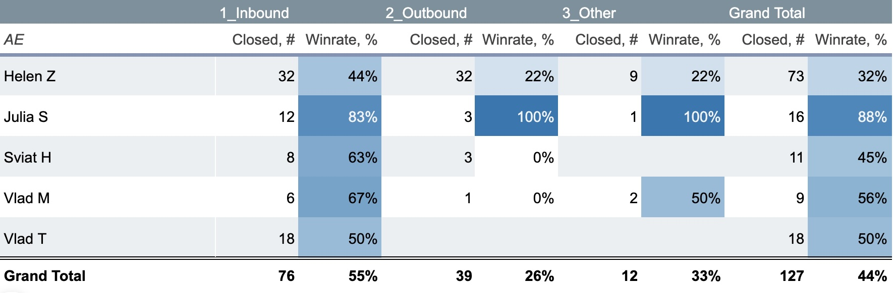
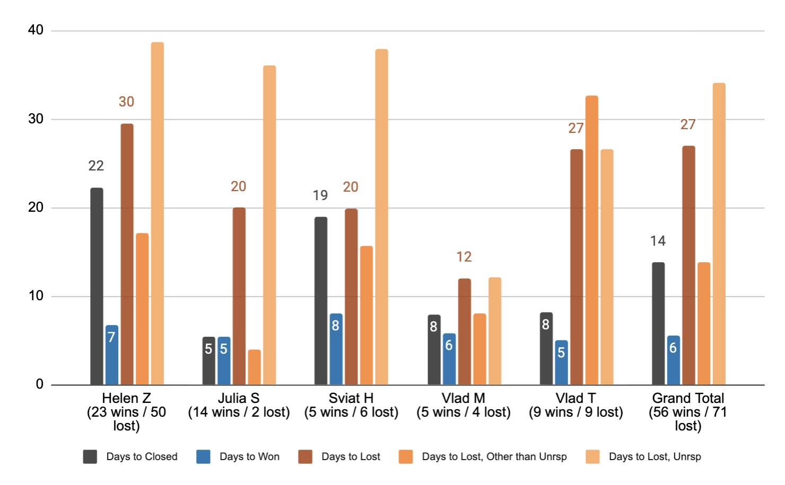
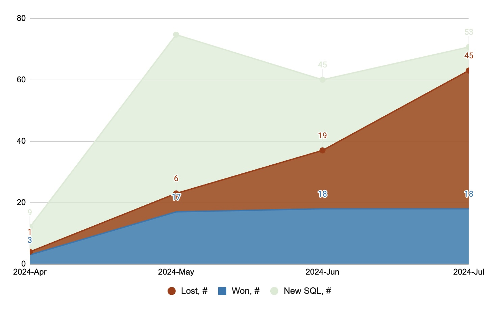
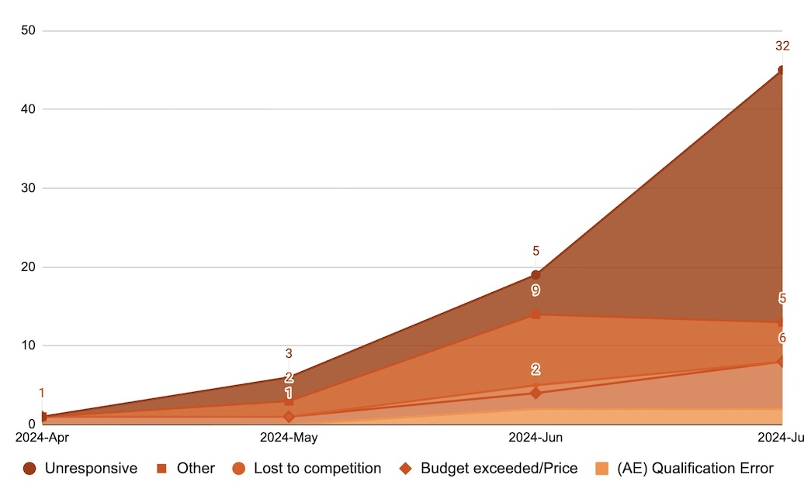
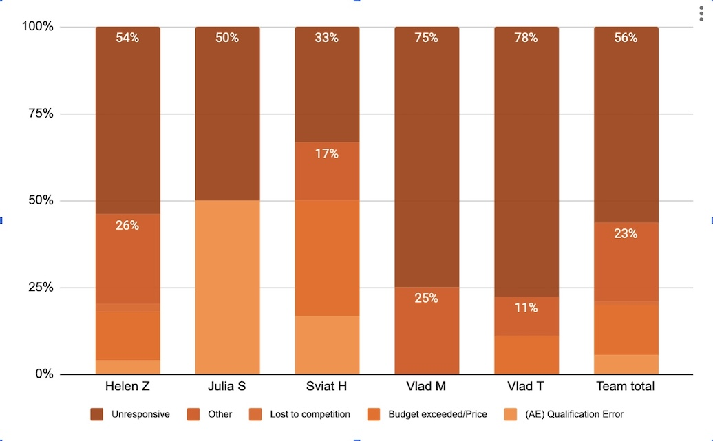
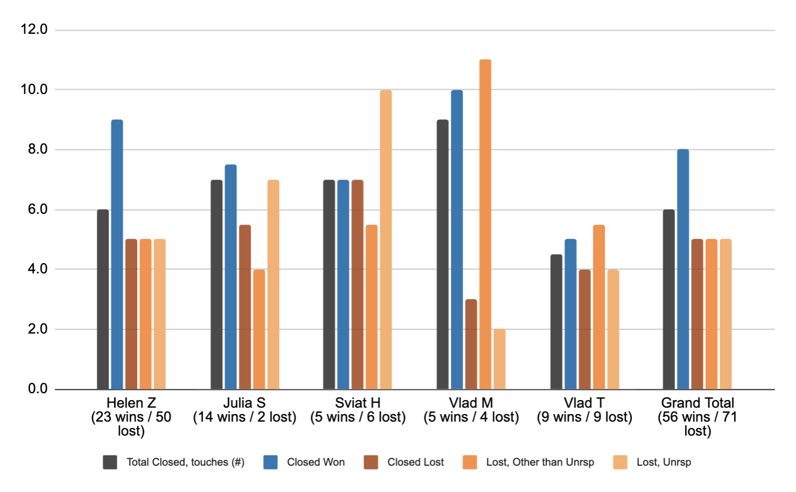
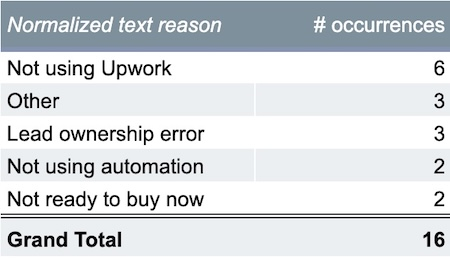

## Background
UpworkLeadAssistant.io is the transactional B2B scale-up selling the leadgen tool into Upwork sell-side agencies and established freelancers. This quick check-in reviews Account Execution (AE) performance four months in after the major operational shift, as two smaller remote sales teams merged into the unified pipeline to align and adopt consistent AE protocols and governance. Among other things, the team was mandated to exercise tighter control over the close dates, timely closing the lapsed opportunities.

## Executive Summary
The analysis is based on HubSpot data for a 4 months deal cohort closed between Apr and Jul 22 2024.  

The cohort lead input accounts for 60% inbound, 31% outbound, and 9% other sources combined. This exhibits mature inbound and solid outbound, employing emails and LinkedIn outreach, that - if sustained - can support the scaling ambitions. These four months represent the pipeline ramp-up that continues into stabilizing the pipeline's value in Jul 24 onwards. Data suggests that won deals close much earlier than the lost with a median cycle of 6 days for Won and 27 for Lost, and that likelihood of the win drops to 19% when a deal crosses 10 days of age. High degree of ghosted opportunities in the lost deals may suggest an immature B2B market with buyers acting in less rational and consistent ways.

#### Key recommendations:
- Enable knowledge-sharing by the best performed rep, Julia S
- Implement team SLA for number of sales touches and time to close focused on the ghosted deals.
#### Technical recommendations:
- Flag sales and onboarding touches apart in the data for cleaner activity metrics
- Add presets in dropdown for deal lost reasons
- Next check-up in a few months upon more data at hand.

## Key Metrics
__Lead sources:__ Lead source weights (cohort of deals closed from Apr 24 to Jul 24). 

__Rep and deal source performance:__ Deal Win rates per AE and lead source, deal cycles (median days to close). 

__AE activity & Lost deal analysis:__ AE number of sales touches, Pipeline won/lost over time, Lost reasons. 

### Rep and deal source performance
#### Winrates per AE and lead channel:

#### Median days to close:

#### Findings:
Outbound opp’s (26% winrate) look nearly twice harder to win than Inbound (55%), benchmarking well against the known market realities. Won deals get far less time to close than the Lost is also in line with the known benchmarks.
Cohort median sales cycle is 14 days, 6 to Won and 27 for Lost. The likelihood of win for any open deal that ages over 10 days drops to only 19%.  
Won deal cycles are more consistent across AEs and show less variation. Lost deal cycles are more spread out, likely because the team is gradually moving away from the past habit of closing lost opportunities too late /not closing.
The recent hire, Vlad M, is standing out with short sale cycles, also with the least number of the closed deals.

#### Recommendations:
Julia S - based on the 16 deals closed inc 3 outbound - is a rockstar; if sustained, provide for knowledge sharing through team coaching sessions, demo reviews etc.  
Vlad M - a newcomer, with little history available; revisit in a few months to get more data.

### Lost deal analysis:
#### New deals (SQL’s) and closed deals over time:
.  

The pipeline continues to ramp-up in Jul 24, the closed lost catch-up with SQL (new deals’) numbers with the median of 27 days to close; need to check-back with a few months more of the data to evaluate the sustained rates.
#### Won/Lost deals and winrate over time:

Lost deals grew in number and in relative terms to the total closed with decrease in pipeline winrate. There is a spike in the closed loss in the last month of Jul 24.

Unresponsive and Others are the lost reasons accounting for the most of lost deals in June 24 and the bulk of the Jul 24 spike.

Sviat H has the least losses due to Unresponsive
Julia S has only 2 deals lost, too little data
Vlad M & Vlad T both have the most Unresponsive lost, though 4 lost for Vlad M is a little data.

AE’s do both sales and onboarding work for the wins, so the number of touches for Won’s would be grossed up for the onboarding touches; this is likely the reason for median Won touches higher than for the Lost.  
The number of touches for Unresponsive lost deals are highly spread out calling for better alignment and improving the team’s cadences as deal aging increases its probability to go lost.  
Sviat H having the smallest fraction of 33% ghosted deals in his pipeline - can set the activity pattern to follow in respect of the ghosted deals with 38 median days to close, and min of 10 sales touches to deliver per an Unresponsive lost deal.  
#### Recommendations:
Implement team SLA for number of sales touches e.g. focusing on deals open longer than e.g. 10 days (81% likelihood of getting lost).
### Lost reasons behind Other:
There are total 16 deals closed lost with Other as the main reason and free text under the Lost Reason detail; after normalizing and and grouping:

  

#### Recommendations:
_'Not using Upwork', 'Not ready to buy now', 'Lead ownership error',_ and _'Not using automation'_ be added as preset reasons for AE Closed Lost Reason dropdown property.
