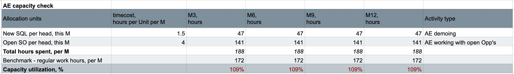

__Executive Summary__  
This bottom-up model projects a SaaS business with a $350 MRR and a 6.25-month customer lifetime. While the partial LTV/CAC ratio of $12.74 appears strong, it only accounts for sales compensation and excludes marketing and lead gen spend. The model highlights a critical retention risk with an 84% NRR, driven by high monthly churn and zero expansion. Sales efficiency improves significantly by Month 12, with AE compensation costs stabilizing at 10% of revenue. Talent acquisition depends on off-shore remote hiring with low base salaries and effective tax rates which may present a bottleneck for engaging skilled customer-facing talent. 

__Key Metrics & Drivers__

__Unit Economics:__ $2,188 LTV; $172 Partial CAC (excl marketing and lead gen); 12.7 LTV/CAC ratio.

__Retention:__ $84% Net Revenue Retention (NRR) with no current expansion revenue.

__Sales Throughput:__ 56 SQLs monthly average (54% Outbound, 41% Inbound, 5% Other).

__Team Efficiency:__ Sales and CS compensation both trend toward 10% of total revenue by Month 12.

__Capacity Utilization:__ AEs are at 109% capacity; CS peaks at 123% (M6) before stabilizing at 96% (M12).

__Recommendations__

Churn Mitigation: The 16% monthly churn is unsustainable. Top priority will be improve the CS team expertise, capacity, and protocols. To raise LTV, we must explore product adjustments for better product-market fit and iterate pricing strategy, adding revenue expansion options for the increased NRR. 

Full CAC Modeling: Evaluate and incorporate Marketing and Leadgen costs per channel to determine the Fully Loaded CAC and ROI.

AE Compensation & Scaling: AE fixed shifts to 55% of AE OTE only in M12, increase variable part earlier in Q2 to incentivize growth. AE capacity remains over-extended at 109%. Accelerate AE hiring in Q1 to address this, avoiding burn-out and opportunity drops.

Introduce Variable CS Pay: Currently, CS is 100% fixed salary. This provides no incentive for retention or expansion. The Retention Bonus can tie to NRR (Net Revenue Retention) and a Commission for Expansion (upsells). Since NRR is low at 84%, a 5-10% variable component tied to reducing churn could significantly impact the bottom line.

CS Compensation & Scaling: Hire CS2 earlier in Q1 instead of Q3 to address the utilization spike of 123% and allow more resources for CS churn-fighting initiatives.

